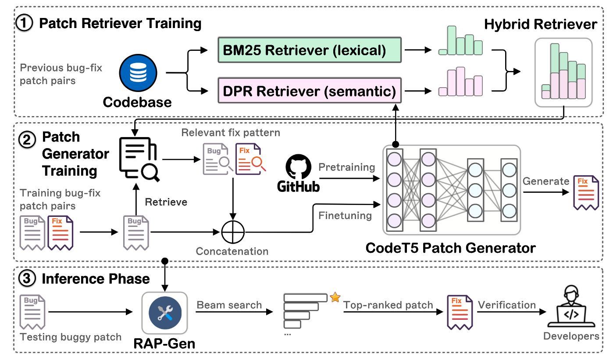

# RAP-Gen

This is the official PyTorch implementation for the following FSE 2023 paper from Salesforce Research:

*Title*: [RAP-Gen: Retrieval-Augmented Patch Generation with CodeT5 for Automatic Program Repair](arxiv)

*Authors*: [Weishi Wang](https://www.linkedin.com/in/weishi-wang/)\*, [Yue Wang](https://yuewang-cuhk.github.io/)
\*, [Shafiq Joty](https://raihanjoty.github.io/), and [Steven C.H. Hoi](https://sites.google.com/view/stevenhoi/home) (*
indicates equal contribution)

# What is this about?
RAP-Gen is a novel Retrieval-Augmented Patch Generation framework with an encoder-decoder code-aware language model
CodeT5 (`60M`,`220M`), explicitly leveraging relevant fix patterns retrieved from a codebase of previous bug-fix pairs
retrieved from a codebase of previous bug-fix pairs to guide the language model for a robust APR system.
To retrieve the most relevant bug-fix pattern, we build a hybrid patch retriever to account for both lexical and
semantic matching based on the raw source code in a language-agnostic manner, which does not rely on any code-specific 
features. See the below overview of RAP-Gen.



## Folder Structure

 ```bash
├── evaluator: the source code of evaluation
│ 
├── sh: the bash shell script files to run experiments
│    
├── data
│   ├── refine_small : the dataset used to train and evaluate task code refinement (small)
│   ├── refine_small : the dataset used to train and evaluate task code refinement (medium)
│   ├── refine_rapgen : the dataset used to train and evaluate task code refinement with RAP-Gen
│   │    ├── small
│   │    ├── medium
│   ├── tfix_rmd : the dataset used to train and evaluate task TFix
│   ├── tfix_rmd_rapgen: the dataset used to train and evaluate task TFix with RAP-Gen
│   ├── selfapr : the SelfAPR dataset used to train and then evaluate for Defects4J  
│   ├── selfapr_rapgen : the SelfAPR dataset used to train and then evaluate for Defects4J with RAP-Gen
│   ├── selfapr_rapgen_P1: the SelfAPR dataset used evaluate Defects4J with RAP-Gen (top_1 bug-fix patern from P1)
│   ├── ...
│   ├── selfapr_rapgen_P16: the SelfAPR dataset used evaluate Defects4J with RAP-Gen (top_1 bug-fix patern from P16)
│ 
├── Defects4j_result 
│   ├──Defects4J v1.2 Results : the correctly generated patches by RAP-Gen (trained with SelfAPR data).
│   ├──Defects4J v2.0 Results : the correctly generated patches by RAP-Gen (trained with SelfAPR data).
│   ├──Defects4J_predicted_patches : the patches generated by RAP-Gen and CodeT5 
│   │    ├── CodeT5
│   │    ├── RAP-Gen
│   ├──Defects4J_result_summary_v1p2.csv)
│   ├──Defects4J_result_summary_v2p0.csv)
│   ├──Defects4J_pattern_analysis : the summary and plotting script of RAP-Gen pattern analysis
└── 
```

## Download Fine-tuned Checkpoints and Data
### (Replace the empty checkpoints and data folders)

* [Fine-tuning data](https://console.cloud.google.com/storage/browser/sfr-codet5-data-research/RAP-Gen/data)
* [Fine-tuned checkpoints](https://console.cloud.google.com/storage/browser/sfr-codet5-data-research/RAP-Gen/checkpoints)

Instructions to download:

```
# pip install gsutil
cd your-cloned-RAP-Gen-path

gsutil -m cp -r "gs://sfr-codet5-data-research/RAP-Gen/data" .
gsutil -m cp -r "gs://sfr-codet5-data-research/RAP-Gen/checkpoints" .
```

## Fine-tuning

### Dependency

 ```
- pickle5
- tqdm
- pandas 1.3.5
- tensorboard 2.4.1
- protobuf 3.15.8
- numpy 1.20.2
- transformers 4.6.1
- packaging 20.9
- tree-sitter 0.2.2
- python 3.7.9
For our A100-SXM4-40GB with CUDA capability sm_80 
  - Pytorch 1.7.1
  - torchvision 0.8.2
  - torchaudio==0.7.2
  - cudatoolkit=11.0
 ```

### How to Run?

Go to `sh` folder, set the `WORKDIR` in `exp_with_args.sh` to be your cloned RAP-Gen repository path.
You can use `run_exp.py` to run a broad set of experiments by simply passing the `model_tag`, `task`, and `sub_task`
arguments. In total, we support six models (
i.e., ['roberta', 'codebert', 'bart_base', 't5_base', 'codet5_small', 'codet5_base'])
and 8 main tasks (
i.e., ['tfix_rmd', 'tfix_rmd_rapgen', 'refine_small', 'refine_medium', 'refine_rapgen', 'selfapr', 'selfapr_rapgen']).
For each task, we use
the `sub_task` to specify which specific datasets to fine-tne on. Below is the full list:

| \--task               | \--sub\_task | Description                                                                                                             |
|-----------------------|--------------|-------------------------------------------------------------------------------------------------------------------------|
| tfix_rmd              | none         | APR task on [TFix](https://proceedings.mlr.press/v139/berabi21a.html) data (deduplicated version)                       |
| tfix_rmd_rapgen       | none         | RAP-Gen APR task on [TFix](https://proceedings.mlr.press/v139/berabi21a.html) data (deduplicated version)               |
| refine_small          | none         | code refinement on [code repair data](https://arxiv.org/pdf/1812.08693.pdf) with small/medium functions                 |
| refine_medium         | none         | code refinement on [code repair data](https://arxiv.org/pdf/1812.08693.pdf) with small/medium functions                 |
| refine_rapgen         | small/medium | RAP-Gen code refinement on [code repair data](https://arxiv.org/pdf/1812.08693.pdf) with small/medium functions         |
| selfapr               | none         | Defects4J APR on [SelfAPR data](https://arxiv.org/pdf/2203.12755.pdf)                                                   |
| selfapr_rapgen        | none         | RAP-Gen Defects4J APR on [SelfAPR data](https://arxiv.org/pdf/2203.12755.pdf)                                           |
| selfapr_rapgen_P1     | none         | RAP-Gen Defects4J APR on [SelfAPR data](https://arxiv.org/pdf/2203.12755.pdf) with top_1 bug-fix patern from P1 (test)  |
| ...                   | ...          | ...                                                                                                                     |
| selfapr_rapgen_P16    | none         | RAP-Gen Defects4J APR on [SelfAPR data](https://arxiv.org/pdf/2203.12755.pdf) with top_1 bug-fix patern from P16 (test) |

For example, if you want to run CodeT5-base model on the selfapr_rapgen task for Defects4J, you can simply run:

```
cd sh
python run_exp.py --model_tag codet5_base --task selfapr_rapgen 
```

For example, if you want to run CodeT5-base model on the refine_rapgen task for code refinement medium, you can simply
run:

```
cd sh
python run_exp.py --model_tag codet5_base --task refine_rapgen --sub_task medium
```

Besides, you can specify:

```
model_dir: where to save fine-tuning checkpoints
res_dir: where to save the performance results 
summary_dir: where to save the training curves
data_num: how many data instances to use, the default -1 is for using the full data
gpu: the index of the GPU to use in the cluster
load_model_dir: where to reload the fine-tuned checkpoints
tag_suffix: indicate the purpose of experiments i.e., finetune. This is mostly for annotation, except for zeroshot.
``` 

You can also revise the suggested
arguments [here](https://) or directly customize the [exp_with_args.sh](https://) bash file.
Please refer to the argument flags in [configs.py](https://) for the full
available options. The saved training curves in `summary_dir` can be visualized
using [tensorboard](https://pypi.org/project/tensorboard/).
Note that we employ one A100 GPU for all fine-tuning experiments.

### Reproduce the Results
Please follow the instructions below to reproduce the results.

---
* `cd sh` then run the inference via `run_exp.py`. 
* Pass the path of your downloaded finetuned checkpoint to load at [here](https://),
  e.g., `file = "xx/checkpoints/codet5_base_selfapr_rapgen_pytorch_model.bin"`
* Run the
  program: `python run_exp.py --model_tag codet5_base --task selfapr_rapgen_P1 --load_model_dir file --tag_suffix reproduce`
* Please refer to our paper for the reproduced results.
## Fault Localization with Gzoltar and Flacoco: faultlocalization

We follow [SelfAPR](https://github.com/ASSERT-KTH/SelfAPR/tree/monperrus-patch-1/Fault_Localization/Defects4J) compute
all the suspicous buggy lines with two fault localization with Gzoltar and Flacoco.

## Code Retriver
We follow [CodeT5+](https://github.com/salesforce/CodeT5/tree/main/CodeT5%2B/code_retrieval) and [CodeBERT](https://github.com/microsoft/CodeBERT/tree/master/CodeBERT/codesearch) to train our  retriever using contrastive loss.

## All perturbed rules generated by [SelfAPR](https://github.com/ASSERT-KTH/SelfAPR/tree/monperrus-patch-1/Fault_Localization/Defects4J)

| Perturb Actions                 | Explanation                                              |
|---------------------------------|----------------------------------------------------------|
| P1 Replace type                 | modify declaring type ...                                |
| P2 Replace operator             | modify operator ==, !=, etc                              |
| P3 replace literal              | modify literal, "STRING", true, false                    |
| P4 replace constructor          | modify constructor                                       |
| P5 replace variable             | modify arguments/swap argumens                           |
| P6 replace condition expression | reduce/expand boolean expression                         |
| P7 replace invocation           | modify invocation                                        |
| P8 compound statement           | compound of rules                                        |
| P9 replace with similarity      | replace by transplanting a similar donor statement       |
| P10 move statement              | move a later statement before the target statement       |
| P11 transplatant statement      | transplanting a donor statement                          |
| P12 transplatant condition      | wrap target statement with an existing conditional block |
| P13 transplatant a block        | insert an existing block (if, loop, etc)                 |
| P14 remove a statement          | delete statement                                         |
| P15 unwrap a statement          | unwrap block                                             |
| P16 remove a block              | remove block                                             |

# Citation

```bibtex
@inproceedings{wang2023rap,
 title = {RAP-Gen: Retrieval-Augmented Patch Generation with CodeT5 for Automatic Program Repair},
 booktitle = {Proceedings of FSE},
 year = {2023},
 author = {Weishi Wang and Yue Wang and Shafiq Joty, and Steven C.H. Hoi},
 url = {https://arxiv.org/abs/2309.06057},
}
```


